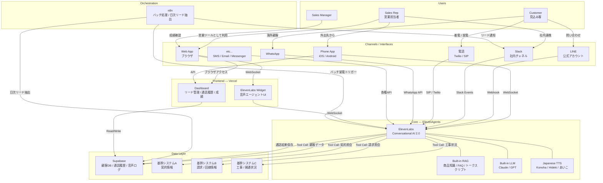
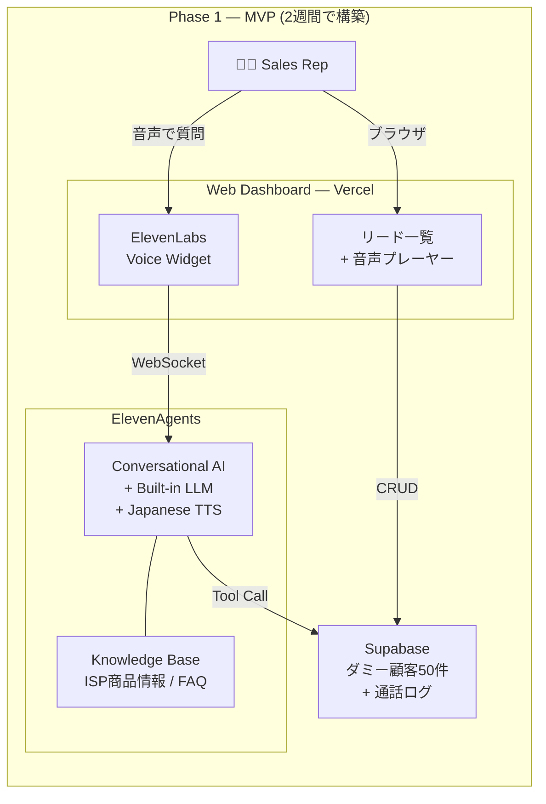

# ISP Approach Bot 🤖📞

> AI 音声エージェントによる ISP 営業アプローチ自動化システム

**ElevenLabs Conversational AI 2.0** をコアエンジンとし、ダミー顧客データをもとに、マルチチャネル（電話 / Web / LINE / Slack 等）で見込み客にアプローチできる統合営業支援ボット。

---

## Architecture

### Full System（最終形）



### MVP（Phase 1 — 2週間）



---

## Tech Stack

| Layer | Technology |
|-------|-----------|
| Core AI | ElevenLabs Conversational AI 2.0 |
| Frontend | Next.js + Tailwind CSS |
| Hosting | Vercel |
| Database | Supabase (PostgreSQL) |
| Telephony | Twilio / SIP (Phase 2) |
| Messaging | LINE Messaging API (Phase 2) |
| Workflow | n8n on Oracle Cloud VM |
| Notification | Slack |

---

## Quick Start

```bash
# Clone
git clone https://github.com/jaydenbarnescs-tech/isp-approach-bot.git
cd isp-approach-bot

# Install dependencies
cd web && npm install

# Set env vars
cp .env.example .env.local
# Edit .env.local with your Supabase + ElevenLabs keys

# Run dev server
npm run dev
```

---

## Documentation

- [PRD (Product Requirements Document)](docs/PRD.md)
- [Full Architecture Diagram](docs/architecture-full.mermaid)
- [MVP Architecture Diagram](docs/architecture-mvp.mermaid)

---

## Roadmap

- [x] Architecture design
- [x] PRD
- [ ] **Phase 1 (W1-W2):** MVP — Dashboard + ElevenLabs Agent + Dummy Data
- [ ] **Phase 2 (W3-W8):** Multi-channel + 基幹システム連携 + Twilio + n8n

---

## License

Private — MGC Inc.
